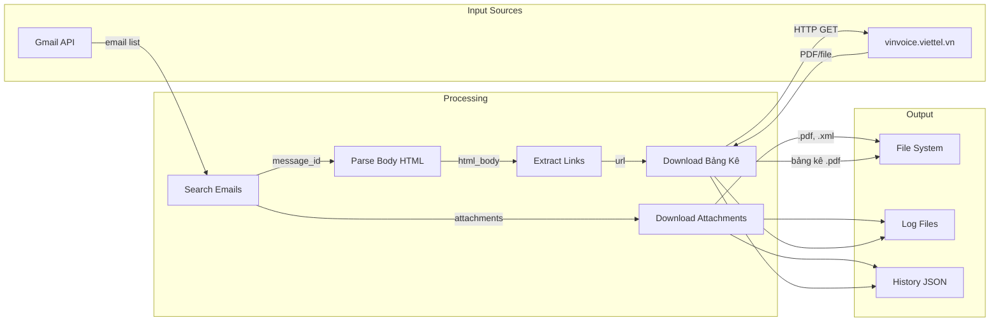

# ARCH: Data Flow

> Skills áp dụng: `04_architecture`, `03_web-scraper`

## Luồng Dữ Liệu Chính



---

## Chi Tiết Từng Bước

### Step 1: Search Emails

```
Input:  Gmail query string (từ Rule)
Output: List[EmailMessage]
Source: Gmail API / IMAP
```

Gmail query ví dụ:
```
subject:"Tổng công ty Cổ phần Bưu Chính Viettel" has:attachment in:inbox
```

### Step 2: Process Each Email

```
Input:  EmailMessage object
Output: (attachments[], body_html, bang_ke_url)
```

### Step 3: Download Attachments

```
Input:  Attachment data (bytes) + filename
Output: File saved to: downloads/<rule_folder>/<filename>
```

File types:
- `.xml` — Hóa đơn XML (0104093672-K26...)
- `.pdf` — Hóa đơn PDF (K26TAN2038744.pdf)

### Step 4: Extract Bảng Kê Link

```
Input:  HTML body string
Output: URL string hoặc None

Pattern tìm: <a> tag với text chứa "chi tiết bảng kê"
```

### Step 5: Download Bảng Kê

```
Input:  URL (https://vinvoice.viettel.vn/...)
Output: PDF file saved to: downloads/<rule_folder>/bang_ke/
```

---

## File Organisation trên Disk

```
downloads/
└── viettel_post/
    ├── 2026-03/                    # Theo tháng
    │   ├── K26TAN2038744.pdf       # Hóa đơn PDF
    │   ├── 0104093672-K26...xml    # Hóa đơn XML  
    │   └── bang_ke/
    │       └── XHDTD-TTHMNQ2-2602-226.pdf  # Bảng kê chi tiết
    └── 2026-02/
        └── ...
```

---

## State Management

### Processed Emails Tracking

```json
// config/processed_emails.json
{
  "last_run": "2026-03-10T14:30:00+07:00",
  "processed": {
    "msg_id_abc123": {
      "subject": "Tổng công ty ...",
      "date": "2026-03-06",
      "rule": "Viettel Post Invoice",
      "attachments_downloaded": ["K26TAN2038744.pdf", "0104093672-K26.xml"],
      "bang_ke_downloaded": "XHDTD-TTHMNQ2-2602-226.pdf",
      "processed_at": "2026-03-10T14:30:05+07:00"
    }
  }
}
```

Mục đích: **Tránh xử lý lại** email đã tải xong.
