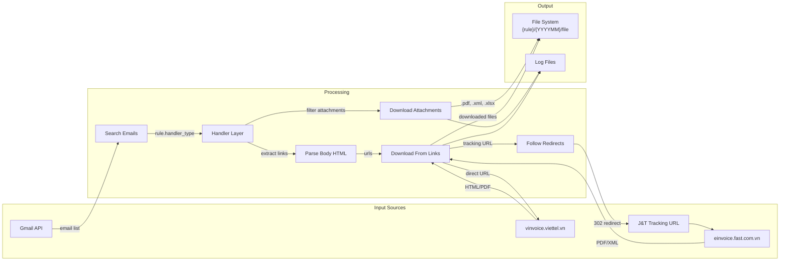

# ARCH: Data Flow

> Skills áp dụng: `04_architecture`, `03_web-scraper`

## Luồng Dữ Liệu Chính (v2.0)



---

## Chi Tiết Từng Luồng — Per Handler

### Flow A: Viettel Post Invoice (handler: `viettel_post`)

```
Email VTP
│
├─ 📎 Attachments: .zip + .pdf
│   └→ Gmail API get_attachments() → save to {rule_folder}/{YYYYMM}/
│
└─ 🔗 Body link: "chi tiết bảng kê"
    └→ https://s1.viettelpost.vn/bang-ke-hoa-don-chi-tiet.do?...
       └→ 200 OK | text/html (52KB) → convert HTML → .xlsx
          └→ Save to {rule_folder}/{YYYYMM}/bangke_*.xlsx
```

### Flow B: J&T E-Invoice (handler: `jt_invoice`)

```
Email J&T Thuận Phong (forwarded)
│
├─ 📎 Attachments: KHÔNG CÓ
│
└─ 🔗 Body links (5 links, wrapped in tracking URL)
    │
    ├─ "Xem bản thể hiện" → tracking redirect → type=1 → PDF (476KB) ✅
    ├─ "einvoice.fast.com.vn" → tracking redirect → Search page     ❌ skip
    ├─ "Tải tệp thông tin"   → tracking redirect → type=2 → XML (5.5KB) ✅
    ├─ "Tải bản thể hiện"    → tracking redirect → type=3 → PDF (476KB) ✅*
    └─ "Tải bảng kê vận đơn" → <a> không có href                    ❌ skip
    
    * type=1 và type=3 trả về cùng PDF → chỉ tải 1
    
    Final: save PDF + XML to {rule_folder}/{YYYYMM}/
```

### Flow C: J&T COD (handler: `jt_cod`)

```
Email J&T COD (forwarded)
│
├─ 📎 Attachment: .xlsx (74KB)
│   └→ Gmail API get_attachments() → save to {rule_folder}/{YYYYMM}/
│
└─ 🔗 Links: KHÔNG CÓ
```

---

## File Organization trên Disk (v2.0)

```
downloads/                              # Global download folder
├── VTP/                                # Per-rule folder (user picks)
│   ├── 202602/                         # Auto-subfolder by email date
│   │   ├── K26TAN2038744.pdf
│   │   ├── 0104093672-K26...xml
│   │   └── bangke_XHDTD-2602-226.xlsx
│   └── 202603/
│       └── ...
│
├── JT_Invoice/
│   ├── 202603/
│   │   ├── 31783_C26TBH.pdf            # Named by invoice number
│   │   ├── 31783_C26TBH.xml
│   │   ├── 31784_C26TBH.pdf
│   │   └── 31784_C26TBH.xml
│   └── 202604/
│       └── ...
│
└── JT_COD/
    ├── 202603/
    │   ├── 251LC17070_..._NU3PWK.xlsx
    │   └── 251LC17070_..._CL86PL.xlsx
    └── 202604/
        └── ...
```

**Subfolder logic:** `email.date.strftime("%Y%m")` → `"202603"`

---

## State Management

### Processed Emails Tracking

```json
// config/processed_emails.json
{
  "last_run": "2026-03-23T14:30:00+07:00",
  "processed": {
    "msg_id_abc123": {
      "subject": "Tổng công ty ...",
      "date": "2026-03-06",
      "rule": "Viettel Post Invoice",
      "handler_type": "viettel_post",
      "files_downloaded": ["K26TAN2038744.pdf", "0104093672-K26.xml", "bangke.xlsx"],
      "processed_at": "2026-03-10T14:30:05+07:00"
    },
    "msg_id_def456": {
      "rule": "J&T Express COD",
      "handler_type": "jt_cod",
      "files_downloaded": ["251LC17070_...xlsx"],
      "processed_at": "2026-03-22T10:00:00+07:00"
    }
  }
}
```

Mục đích: **Tránh xử lý lại** email đã tải xong.
