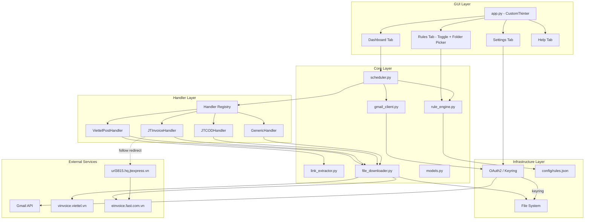
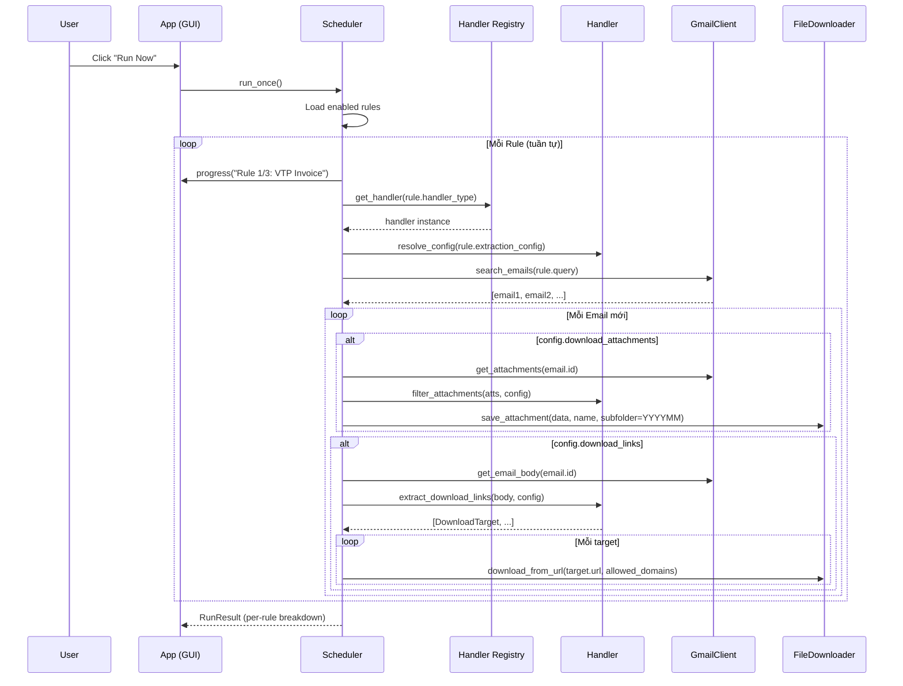

# ARCH: System Architecture

> Skills áp dụng: `04_architecture`, `05_async-python-patterns`, `08_clean-code`

## Tổng Quan

Email Auto-Download Tool là một **desktop application** chạy trên Windows, tự động hóa việc tải file hóa đơn từ Gmail. Hỗ trợ nhiều nhà cung cấp (Viettel Post, J&T Express...) thông qua **plugin handler architecture**.

---

## Kiến Trúc Tổng Thể



---

## Layered Architecture

```
┌─────────────────────────────────────┐
│         GUI Layer (app.py)          │  ← CustomTkinter UI
│  Rule cards, toggle, folder picker  │
├─────────────────────────────────────┤
│     Handler Layer (src/handlers/)   │  ← Plugin per provider
│  ViettelPost, JTInvoice, JTCOD,    │
│  Generic + BaseEmailHandler         │
├─────────────────────────────────────┤
│        Core Layer (src/)            │  ← Business logic
│  gmail_client, file_downloader,     │
│  rule_engine, scheduler, models     │
├─────────────────────────────────────┤
│     Infrastructure Layer            │  ← External I/O
│  OAuth2, file system, HTTP,         │
│  keyring, JSON config               │
└─────────────────────────────────────┘
```

**Quy tắc:**
- GUI Layer → gọi Core Layer, nhận handler metadata cho display
- **Handler Layer** → khai báo extraction config + logic đặc thù per provider
- Core Layer → KHÔNG phụ thuộc GUI hoặc handler cụ thể
- Infrastructure → được inject vào Core qua DI

---

## Cấu Trúc Thư Mục

```
ext_auto_load_mail/
├── app.py                    # Entry point + GUI
├── requirements.txt
├── pyproject.toml
├── README.md
│
├── src/                      # Core modules
│   ├── __init__.py
│   ├── gmail_client.py       # Gmail connection
│   ├── link_extractor.py     # HTML link parsing
│   ├── file_downloader.py    # File download logic
│   ├── rule_engine.py        # Multi-rule management
│   ├── scheduler.py          # Scheduled execution
│   ├── models.py             # Shared data models
│   │
│   └── handlers/             # ← NEW: Plugin handlers
│       ├── __init__.py       # Registry + factory
│       ├── base.py           # BaseEmailHandler + ExtractionConfig
│       ├── generic.py        # Default handler
│       ├── viettel_post.py   # VTP: HTML→xlsx, bảng kê
│       └── jt_express.py     # J&T: redirect + COD
│
├── config/
│   ├── rules.json            # Email rules (dev-configured)
│   └── settings.json         # App settings
│
├── downloads/                # Downloaded files
│   ├── VTP/                  # Per-rule folders
│   │   ├── 202602/           # Auto-subfolder by month
│   │   └── 202603/
│   ├── JT_Invoice/
│   └── JT_COD/
│
├── tests/
│   ├── test_link_extractor.py
│   ├── test_rule_engine.py
│   ├── test_file_downloader.py
│   └── test_handlers.py      # ← NEW
│
├── docs/
│
└── .agent/
    └── skills/
```

---

## Handler Architecture — 2 Tầng

```
┌───────────────────────────────────────────┐
│            rules.json                      │
│  ┌───────────────────────────────────┐    │
│  │ Rule: "VTP Invoice"              │    │
│  │   handler_type: "viettel_post"   │    │  ← Tầng 1: DATA (JSON config)
│  │   extraction_config: {           │    │     Thay đổi khi template update
│  │     link_patterns: [...]         │    │     KHÔNG cần rebuild .exe
│  │     allowed_domains: [...]       │    │
│  │   }                              │    │
│  └───────────────────────────────────┘    │
└──────────────────┬────────────────────────┘
                   │ load
┌──────────────────▼────────────────────────┐
│           Handler Class                    │
│  ViettelPostHandler(BaseEmailHandler)      │  ← Tầng 2: CODE (Python class)
│    - extract_download_links(body, config)  │     Thay đổi khi LOGIC thay đổi
│    - process_download()  # HTML→xlsx       │     (hiếm khi)
│    - DEFAULT_CONFIG = {...}                │
└───────────────────────────────────────────┘
```

**Nguyên tắc:**
- Template thay đổi (vd: đổi domain) → sửa **JSON config** → restart app
- Logic thay đổi (vd: cần redirect) → sửa **handler class** → rebuild .exe
- Nhà cung cấp mới hoàn toàn → tạo **handler mới** + config

---

## Design Decisions (ADRs)

### ADR-001: Gmail API vs IMAP

| Tiêu chí | Gmail API | IMAP |
|----------|-----------|------|
| Setup | Cần Google Cloud Project | Chỉ cần App Password |
| Tính năng | Đầy đủ (search, labels, attachments) | Cơ bản |
| Rate limit | 250 units/user/second | Không rõ |
| An toàn | OAuth2 token, auto-refresh | Password stored |

**Quyết định:** Mặc định Gmail API.

### ADR-002: Sync vs Async

**Quyết định:** Dùng **threading** cho GUI + sync I/O trong background thread.

- GUI chạy trên main thread
- Email processing chạy trên background thread
- Log queue (thread-safe) để cập nhật GUI

### ADR-003: Data Storage

**Quyết định:** Không dùng database, lưu state bằng JSON files.

- `config/rules.json` — email rules (dev-configured)
- `config/settings.json` — app settings (user-configured)
- `config/processed_emails.json` — tránh duplicate

### ADR-004: Plugin Architecture (v2.0)

**Quyết định:** Dùng **Strategy Pattern + Handler Registry** (data-driven, nội bộ).

Lý do chọn hướng này thay vì file-system plugin:
- Đối tượng sử dụng là kế toán, không biết code
- Phân phối dạng 1 file .exe
- Đủ linh hoạt: thêm handler = thêm 1 class + đăng ký

### ADR-005: Auto-subfolder by Date (v2.0)

**Quyết định:** File tải về tự động phân vào `{YYYYMM}/` dựa vào ngày nhận email.

```
{rule_output_folder}/{YYYYMM}/{filename}
VTP/202603/K26TAN2038744.pdf
JT_COD/202603/251LC17070_...xlsx
```

---

## Component Interaction Flow


