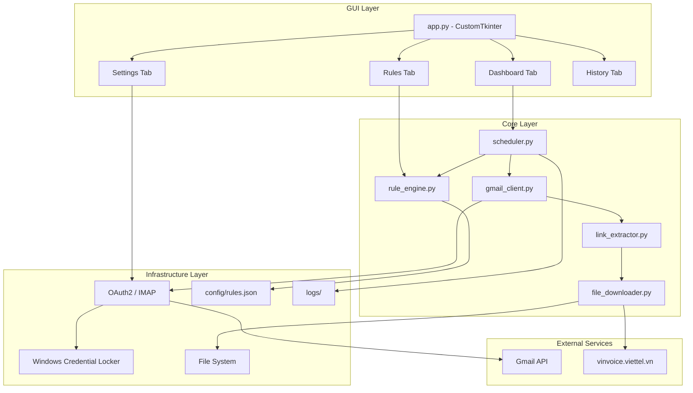

# ARCH: System Architecture

> Skills áp dụng: `04_architecture`, `05_async-python-patterns`, `08_clean-code`

## Tổng Quan

Email Auto-Download Tool là một **desktop application** chạy trên Windows, tự động hóa việc tải file hóa đơn từ Gmail.

---

## Kiến Trúc Tổng Thể



---

## Layered Architecture (Clean Architecture)

```
┌─────────────────────────────────────┐
│         GUI Layer (app.py)          │  ← CustomTkinter UI
│  Presentation logic, user events    │
├─────────────────────────────────────┤
│        Core Layer (src/)            │  ← Business logic
│  gmail_client, link_extractor,      │
│  file_downloader, rule_engine,      │
│  scheduler                          │
├─────────────────────────────────────┤
│     Infrastructure Layer            │  ← External I/O
│  OAuth2, file system, HTTP,         │
│  keyring, JSON config               │
└─────────────────────────────────────┘
```

**Quy tắc:**
- GUI Layer → chỉ gọi Core Layer
- Core Layer → KHÔNG phụ thuộc GUI
- Infrastructure → được inject vào Core qua DI

---

## Cấu Trúc Thư Mục

```
ext_auto_load_mail/
├── app.py                    # Entry point + GUI
├── requirements.txt
├── pyproject.toml
├── README.md
│
├── src/                      # Core modules
│   ├── __init__.py
│   ├── gmail_client.py       # Gmail connection
│   ├── link_extractor.py     # HTML link parsing
│   ├── file_downloader.py    # File download logic
│   ├── rule_engine.py        # Multi-rule management
│   ├── scheduler.py          # Scheduled execution
│   └── models.py             # Shared data models
│
├── config/                   # User configuration
│   ├── rules.json            # Email processing rules
│   └── settings.json         # App settings
│
├── downloads/                # Downloaded files
│   └── viettel_post/         # Per-rule subfolders
│
├── logs/                     # Execution logs
│   └── app.log
│
├── tests/                    # Unit tests
│   ├── test_link_extractor.py
│   ├── test_rule_engine.py
│   └── test_file_downloader.py
│
├── docs/                     # Project documentation
│
└── .agent/                   # Agent skills
    └── skills/
```

---

## Design Decisions (ADRs)

### ADR-001: Gmail API vs IMAP

| Tiêu chí | Gmail API | IMAP |
|----------|-----------|------|
| Setup | Cần Google Cloud Project | Chỉ cần App Password |
| Tính năng | Đầy đủ (search, labels, attachments) | Cơ bản |
| Rate limit | 250 units/user/second | Không rõ |
| An toàn | OAuth2 token, auto-refresh | Password stored |
| Offline | ❌ Cần internet | ❌ Cần internet |

**Quyết định:** Hỗ trợ cả 2, mặc định Gmail API.

### ADR-002: Sync vs Async

**Quyết định:** Dùng **threading** cho GUI + **asyncio** cho batch downloads.

- GUI chạy trên main thread
- Email processing chạy trên background thread
- File downloads dùng asyncio.gather() trong background thread

### ADR-003: Data Storage

**Quyết định:** Không dùng database, lưu state bằng JSON files.

- `config/rules.json` — email rules
- `config/settings.json` — app settings
- `logs/processed_emails.json` — danh sách email đã xử lý (tránh duplicate)

---

## Component Interaction Flow

```mermaid
sequenceDiagram
    participant User
    participant GUI as App (GUI)
    participant Sched as Scheduler
    participant Gmail as GmailClient
    participant Link as LinkExtractor
    participant DL as FileDownloader

    User->>GUI: Click "Run Now"
    GUI->>Sched: run_once()
    Sched->>Sched: Load enabled rules
    
    loop Mỗi Rule
        Sched->>Gmail: search_emails(rule.query)
        Gmail-->>Sched: [email1, email2, ...]
        
        loop Mỗi Email mới
            Sched->>Gmail: get_attachments(email.id)
            Gmail-->>Sched: [attach1, attach2]
            Sched->>DL: save_attachment(data, filename)
            DL-->>Sched: DownloadResult
            
            Sched->>Gmail: get_email_body(email.id)
            Gmail-->>Sched: html_body
            Sched->>Link: extract_bang_ke_link(html_body)
            Link-->>Sched: url
            
            alt URL found
                Sched->>DL: download_from_url(url)
                DL-->>Sched: DownloadResult
            end
            
            Sched->>GUI: update_log(result)
        end
    end
    
    Sched-->>GUI: Hoàn tất
```
