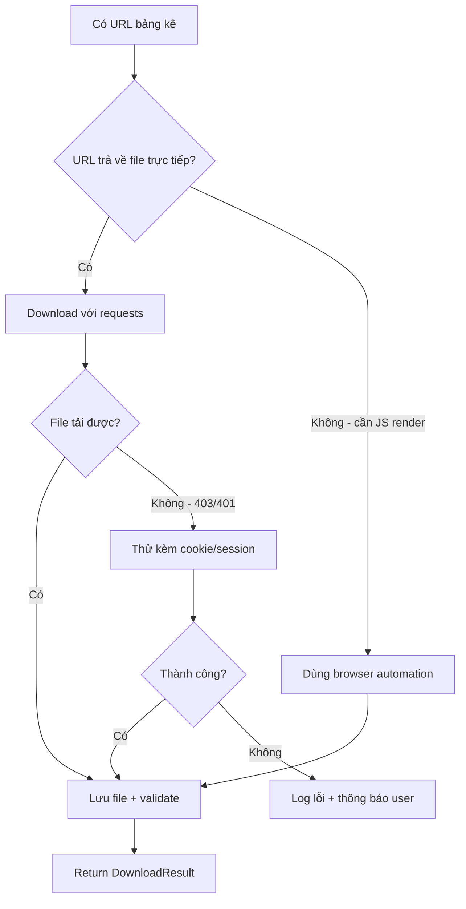

# CORE: File Downloader Module

> Skills áp dụng: `03_web-scraper`, `05_async-python-patterns`, `09_error-handling-patterns`

## Mục Đích

Download file đính kèm từ Gmail và tải bảng kê từ URL `vinvoice.viettel.vn`.

---

## API Contract

```python
from pathlib import Path
from dataclasses import dataclass
from enum import Enum

class DownloadStatus(Enum):
    SUCCESS = "success"
    SKIPPED_DUPLICATE = "skipped_duplicate"
    FAILED = "failed"
    FAILED_RETRY_EXHAUSTED = "failed_retry_exhausted"

@dataclass
class DownloadResult:
    status: DownloadStatus
    filepath: Path | None
    filename: str
    size_bytes: int
    error_message: str | None = None

class FileDownloader:
    """
    Download files từ nhiều nguồn.
    Có duplicate check, retry logic, và progress callback.
    """

    def __init__(
        self,
        output_dir: Path,
        skip_duplicates: bool = True,
        max_retries: int = 3
    ):
        pass

    def save_attachment(
        self,
        data: bytes,
        filename: str,
        subfolder: str = ""
    ) -> DownloadResult:
        """Lưu file đính kèm từ Gmail về disk."""

    def download_from_url(
        self,
        url: str,
        filename: str | None = None,
        subfolder: str = ""
    ) -> DownloadResult:
        """
        Tải file từ URL (bảng kê từ vinvoice.viettel.vn).
        Tự detect filename từ Content-Disposition header nếu không chỉ định.
        """

    def is_duplicate(self, filename: str, subfolder: str = "") -> bool:
        """Kiểm tra file đã tồn tại chưa (by name + size)."""
```

---

## Download Strategy cho Bảng Kê



---

## Async Download (từ `05_async-python-patterns`)

```python
import asyncio
import aiohttp

async def download_batch(
    self,
    downloads: list[tuple[str, str]],  # [(url, filename), ...]
    max_concurrent: int = 5
) -> list[DownloadResult]:
    """
    Download nhiều file song song.
    Dùng semaphore để giới hạn concurrent connections.
    """
    semaphore = asyncio.Semaphore(max_concurrent)
    
    async def _download_one(url: str, filename: str):
        async with semaphore:
            async with aiohttp.ClientSession() as session:
                async with session.get(url) as response:
                    data = await response.read()
                    return self.save_attachment(data, filename)
    
    tasks = [_download_one(url, fn) for url, fn in downloads]
    return await asyncio.gather(*tasks, return_exceptions=True)
```

---

## Error Handling (từ `09_error-handling-patterns`)

```python
# Retry with exponential backoff
@retry(
    stop=stop_after_attempt(3),
    wait=wait_exponential(multiplier=1, min=2, max=30),
    retry=retry_if_exception_type((ConnectionError, TimeoutError)),
)
def _http_get(self, url: str) -> requests.Response:
    response = requests.get(url, timeout=30, allow_redirects=True)
    response.raise_for_status()
    return response
```

**Lỗi thường gặp:**

| Lỗi | Xử lý |
|-----|--------|
| `ConnectionError` | Retry 3 lần, exponential backoff |
| `TimeoutError` | Retry, tăng timeout |
| `403 Forbidden` | Log warning, skip file |
| `404 Not Found` | Log error, skip file |
| Disk full | Raise `DiskSpaceError`, dừng batch |

---

## Duplicate Detection

```python
def is_duplicate(self, filename: str, subfolder: str = "") -> bool:
    target = self.output_dir / subfolder / filename
    if not target.exists():
        return False
    
    # Check by name only (fast)
    # Future: could also check by hash (SHA256) for renamed files
    return True
```

---

## Dependencies

```
requests>=2.31.0
aiohttp>=3.9.0  # async downloads
tenacity>=8.2.0  # retry logic
```
