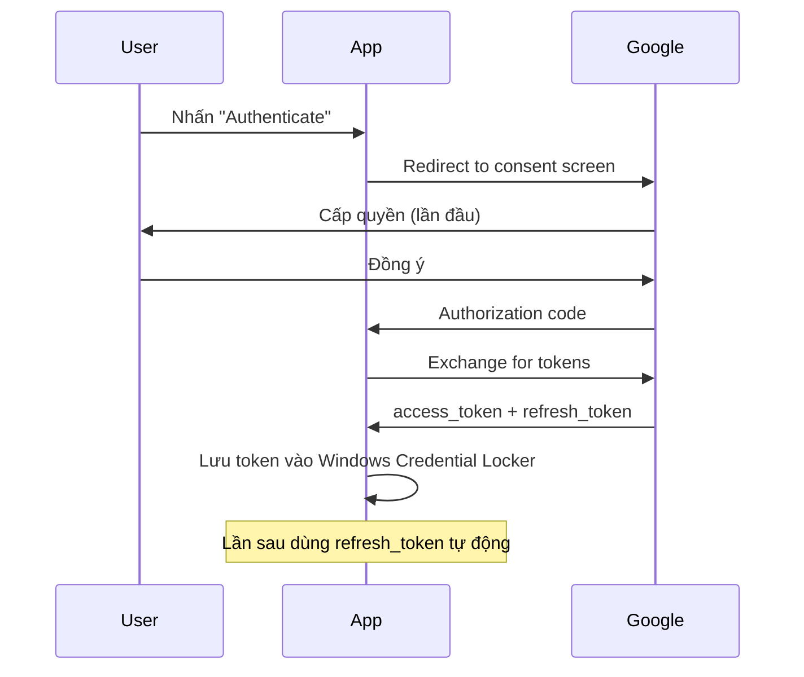

# CORE: Gmail Client Module

> Skills áp dụng: `01_gmail-automation`, `02_python-pro`, `06_secrets-management`, `09_error-handling-patterns`

## Mục Đích

Module kết nối Gmail để tìm, đọc email và tải file đính kèm. Hỗ trợ 2 phương thức: **Gmail API (OAuth2)** và **IMAP**.

---

## API Contract

```python
class GmailClient:
    """
    Facade pattern: cung cấp 1 interface thống nhất
    cho cả Gmail API và IMAP backends.
    """
    
    def __init__(self, auth_method: str = "oauth2"):
        """
        Args:
            auth_method: "oauth2" hoặc "imap"
        """
    
    def authenticate(self) -> bool:
        """Xác thực với Gmail. Mở browser nếu lần đầu (OAuth2)."""
    
    def search_emails(
        self,
        query: str,
        max_results: int = 50,
        label: str = "INBOX"
    ) -> list[EmailMessage]:
        """
        Tìm email theo Gmail query syntax.
        
        Args:
            query: Gmail search query (e.g. "subject:Viettel has:attachment")
            max_results: Giới hạn số email trả về
            label: Label Gmail cần tìm
        
        Returns:
            List EmailMessage objects
        """
    
    def get_email_body(self, message_id: str) -> str:
        """Lấy body HTML của email."""
    
    def get_attachments(self, message_id: str) -> list[Attachment]:
        """Lấy danh sách file đính kèm."""
    
    def download_attachment(
        self, 
        message_id: str,
        attachment_id: str,
        output_dir: Path
    ) -> Path:
        """Tải 1 file đính kèm về thư mục chỉ định."""
    
    def add_label(self, message_id: str, label: str) -> None:
        """Gán nhãn cho email (đánh dấu đã xử lý)."""
    
    def remove_label(self, message_id: str, label: str) -> None:
        """Bỏ nhãn khỏi email."""
```

---

## Data Models

```python
from dataclasses import dataclass
from datetime import datetime

@dataclass
class EmailMessage:
    id: str
    subject: str
    sender: str
    date: datetime
    snippet: str
    has_attachments: bool
    labels: list[str]

@dataclass
class Attachment:
    id: str
    filename: str
    mime_type: str
    size: int  # bytes
```

---

## Authentication Flow

### OAuth2 (Gmail API) — Khuyến nghị



### Token Storage (via `06_secrets-management`)

```python
import keyring

SERVICE_NAME = "email-auto-download"

def save_token(token_data: dict) -> None:
    keyring.set_password(SERVICE_NAME, "oauth_token", json.dumps(token_data))

def load_token() -> dict | None:
    data = keyring.get_password(SERVICE_NAME, "oauth_token")
    return json.loads(data) if data else None
```

**Quy tắc bảo mật:**
- ❌ KHÔNG lưu token vào file text
- ❌ KHÔNG commit credentials vào git
- ✅ Dùng Windows Credential Locker (keyring)
- ✅ Token tự động refresh khi hết hạn

---

## Error Handling (via `09_error-handling-patterns`)

```python
class GmailAuthError(Exception):
    """Lỗi xác thực Gmail."""

class GmailQuotaError(Exception):
    """Vượt quota API."""

class GmailConnectionError(Exception):
    """Không kết nối được Gmail."""

# Retry pattern
from tenacity import retry, stop_after_attempt, wait_exponential

@retry(
    stop=stop_after_attempt(3),
    wait=wait_exponential(multiplier=1, min=2, max=10),
    reraise=True
)
def _api_call(self, endpoint: str, **kwargs):
    """Gọi Gmail API với auto-retry."""
```

---

## Gmail Query Reference

| Query | Mô tả |
|-------|--------|
| `subject:Viettel` | Email có "Viettel" trong tiêu đề |
| `from:noreply@viettelpost.com.vn` | Email từ Viettel Post |
| `has:attachment` | Có file đính kèm |
| `is:unread` | Chưa đọc |
| `newer_than:7d` | Trong 7 ngày gần nhất |
| `after:2026/03/01` | Sau ngày cụ thể |

---

## Dependencies

```
google-api-python-client>=2.100.0
google-auth-httplib2>=0.2.0
google-auth-oauthlib>=1.2.0
keyring>=25.0.0
tenacity>=8.2.0
```
