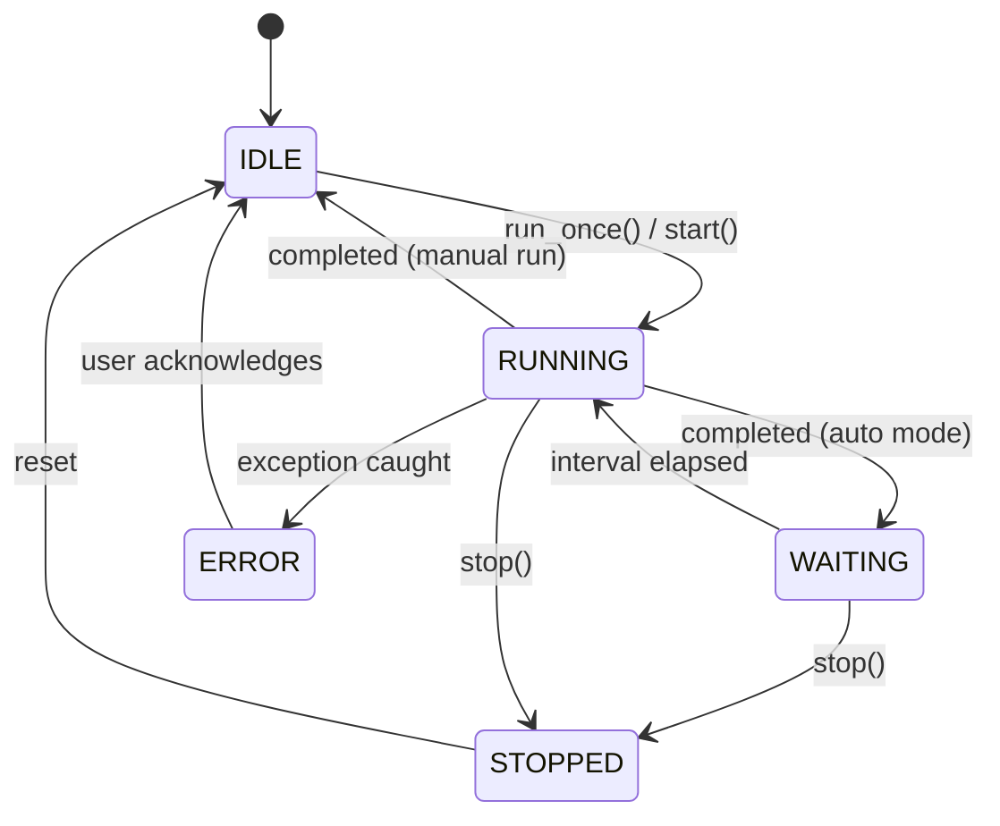

# FEATURE: Scheduler & Automation

> Skills áp dụng: `05_async-python-patterns`, `09_error-handling-patterns`

## Mục Đích

Module tự động chạy email processing theo lịch, hỗ trợ cả chạy thủ công (run once) và chạy nền liên tục.

---

## API Contract

```python
from enum import Enum
from typing import Callable
from datetime import datetime

class SchedulerState(Enum):
    IDLE = "idle"
    RUNNING = "running"
    WAITING = "waiting"
    ERROR = "error"
    STOPPED = "stopped"

class Scheduler:
    """
    Điều phối việc chạy email processing.
    Chạy trên background thread, giao tiếp với GUI qua callbacks.
    """
    
    def __init__(
        self,
        gmail_client: GmailClient,
        rule_engine: RuleEngine,
        file_downloader: FileDownloader,
        link_extractor: LinkExtractor,
        interval_minutes: int = 30,
        on_log: Callable[[str, str], None] = None,  # (level, message)
        on_state_change: Callable[[SchedulerState], None] = None,
    ):
        pass
    
    def run_once(self) -> RunResult:
        """Chạy 1 lần tất cả enabled rules."""
    
    def start(self) -> None:
        """Bắt đầu chạy tự động theo interval."""
    
    def stop(self) -> None:
        """Dừng scheduler."""
    
    @property
    def state(self) -> SchedulerState:
        """Trạng thái hiện tại."""
    
    @property
    def next_run(self) -> datetime | None:
        """Thời gian chạy tiếp theo."""
    
    @property
    def last_result(self) -> RunResult | None:
        """Kết quả lần chạy gần nhất."""
```

---

## RunResult

```python
@dataclass
class RunResult:
    started_at: datetime
    finished_at: datetime
    rules_processed: int
    emails_found: int
    attachments_downloaded: int
    bang_ke_downloaded: int
    errors: list[str]
    skipped_duplicates: int
    
    @property
    def duration_seconds(self) -> float:
        return (self.finished_at - self.started_at).total_seconds()
    
    @property
    def is_success(self) -> bool:
        return len(self.errors) == 0
```

---

## Scheduling Strategy



---

## Error Recovery

| Lỗi | Hành vi |
|-----|---------|
| Gmail auth expired | Tự refresh token, nếu fail → báo user |
| Network error | Retry 3 lần, backoff 2-4-8 giây |
| Vinvoice.viettel.vn down | Skip bảng kê, log warning, tiếp tục email khác |
| Disk full | Dừng ngay, báo user |
| Uncaught exception | Log full traceback, set state = ERROR |

---

## Logging

```python
import logging

logger = logging.getLogger("email_auto_download")
logger.setLevel(logging.INFO)

# File handler — persistent log
file_handler = logging.FileHandler("logs/app.log", encoding="utf-8")
file_handler.setFormatter(logging.Formatter(
    "%(asctime)s [%(levelname)s] %(message)s"
))

# Queue handler — stream to GUI
queue_handler = QueueHandler(log_queue)

logger.addHandler(file_handler)
logger.addHandler(queue_handler)
```
