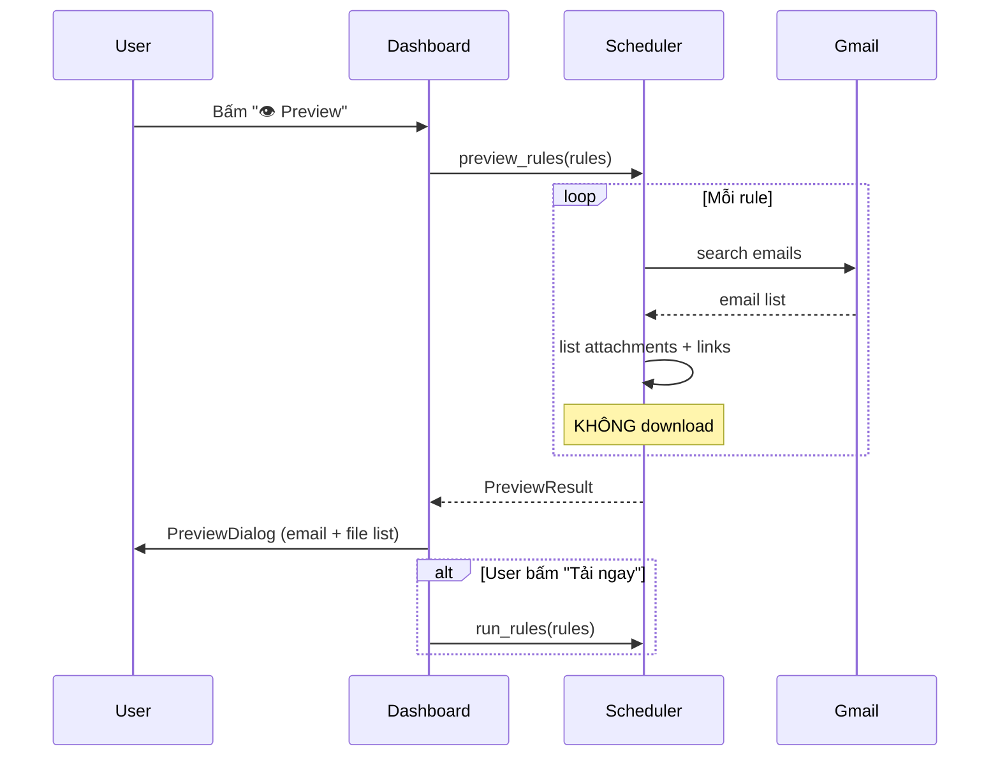

# FEATURE: Scheduler & Automation (v2.1)

> Skills áp dụng: `05_async-python-patterns`, `09_error-handling-patterns`

## Mục Đích

Module điều phối email processing: run once, run rules, preview (dry-run), auto-schedule, và history tracking.

---

## API Contract (v2.1)

```python
class Scheduler:
    def run_once(self) -> RunResult:
        """Chạy 1 lần tất cả enabled rules."""
    
    def run_rules(self, rules: list[EmailRule]) -> RunResult:
        """Chạy 1 hoặc nhiều rule cụ thể."""
    
    def preview_rules(self, rules: list[EmailRule]) -> PreviewResult:
        """NEW v2.1 — Quét email + list files (KHÔNG download).
        
        Returns:
            PreviewResult với danh sách email + file dự kiến.
        """
    
    def start(self) -> None
    def stop(self) -> None
    
    @property
    def state(self) -> SchedulerState
    
    @property
    def next_run(self) -> datetime | None
    
    @property
    def last_result(self) -> RunResult | None
```

---

## Preview Flow (NEW v2.1)



---

## Download History (NEW v2.1)

```python
class DownloadHistory:
    """Track downloaded files across runs."""
    FILE = "config/download_history.json"
    
    def add_entry(self, rule_name, filename, status, timestamp)
    def get_entries(self, rule_filter=None, limit=200) -> list[HistoryEntry]
    def get_stats(self) -> dict:
        """Return {today: int, week: int, total: int}"""
    def clear(self)
```

### Integration:
- `scheduler._process_rule()` → gọi `history.add_entry()` sau mỗi file
- `app.py` Stats card → gọi `history.get_stats()`
- `app.py` HistoryDialog → gọi `history.get_entries()`

---

## Data Models (NEW v2.1)

```python
@dataclass
class PreviewItem:
    rule_name: str
    rule_icon: str
    email_subject: str
    email_date: str
    files: list[str]      # filenames dự kiến
    file_sources: list[str]  # "📎 attachment" hoặc "🔗 link"

@dataclass 
class PreviewResult:
    items: list[PreviewItem]
    total_emails: int = 0
    total_files: int = 0
    duration_seconds: float = 0.0

@dataclass
class HistoryEntry:
    timestamp: str        # ISO format
    rule_name: str
    filename: str
    status: str           # "downloaded" | "skipped" | "error"
```

---

## Error Recovery (unchanged)

| Lỗi | Hành vi |
|-----|---------|
| Gmail auth expired | Tự refresh token, nếu fail → báo user |
| Network error | Retry 3 lần, backoff 2-4-8 giây |
| 1 rule lỗi | Log error, tiếp tục rule tiếp theo |
| Disk full | Dừng ngay, báo user |
