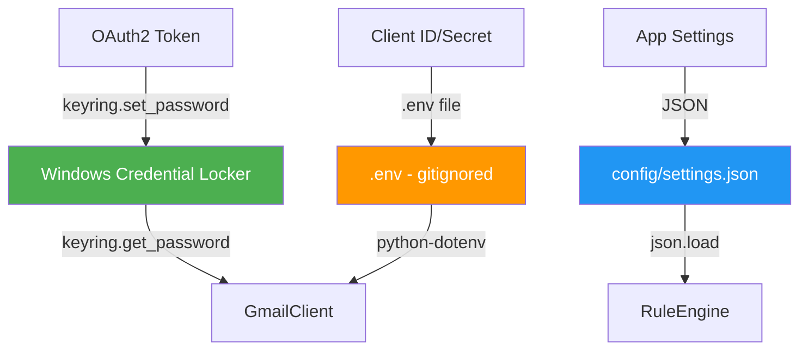

# SPECS: Security & Credentials

> Skills áp dụng: `06_secrets-management`, `09_error-handling-patterns`

## Mục Đích

Tiêu chuẩn bảo mật cho việc lưu trữ và quản lý credentials Gmail, OAuth tokens, và dữ liệu nhạy cảm.

---

## Nguyên Tắc Bảo Mật

### 🔴 KHÔNG BAO GIỜ

- ❌ Hardcode password/token trong source code
- ❌ Commit credentials vào git
- ❌ Lưu token dạng plain text trên disk
- ❌ Log nội dung token hoặc password
- ❌ Truyền credentials qua command line arguments

### 🟢 LUÔN LUÔN

- ✅ Dùng Windows Credential Locker (via `keyring`)
- ✅ Sử dụng `.gitignore` để loại trừ credential files
- ✅ Tối thiểu quyền (Gmail API scopes)
- ✅ Auto-rotate tokens khi có thể
- ✅ Mask sensitive data trong logs

---

## Credential Storage Architecture



---

## Credential Types

### 1. OAuth2 Tokens — Windows Credential Locker

```python
import keyring
import json

SERVICE = "email-auto-download"

# Lưu token
def save_oauth_token(token_data: dict) -> None:
    keyring.set_password(SERVICE, "gmail_token", json.dumps(token_data))

# Đọc token
def load_oauth_token() -> dict | None:
    raw = keyring.get_password(SERVICE, "gmail_token")
    return json.loads(raw) if raw else None

# Xóa token (logout)
def delete_oauth_token() -> None:
    keyring.delete_password(SERVICE, "gmail_token")
```

### 2. Client ID/Secret — Bundled `credentials.json`

Ứng dụng sử dụng file `credentials.json` (bundled trong .exe hoặc đặt ở thư mục gốc).

> Xem hướng dẫn lấy file: [CREDENTIALS_GUIDE.md](../CREDENTIALS_GUIDE.md)

```python
# GmailClient tự tìm credentials.json:
# 1. Thư mục hiện tại (dev + user override)
# 2. sys._MEIPASS (bundled .exe)
creds_file = GmailClient._find_credentials()
```

### 3. IMAP Credentials (nếu dùng)

```python
# App Password — lưu vào keyring, KHÔNG lưu file
keyring.set_password(SERVICE, "imap_password", app_password)
```

---

## Gmail API Scopes (Tối Thiểu Quyền)

```python
SCOPES = [
    "https://www.googleapis.com/auth/gmail.readonly",     # Đọc email
    "https://www.googleapis.com/auth/gmail.modify",       # Gán nhãn
]

# KHÔNG dùng gmail.full_access trừ khi thực sự cần
```

| Scope | Quyền | Cần thiết? |
|-------|-------|-----------|
| `gmail.readonly` | Đọc email, tải đính kèm | ✅ Bắt buộc |
| `gmail.modify` | Gán nhãn, đánh dấu đã đọc | ✅ Cần cho labeling |
| `gmail.send` | Gửi email | ❌ Không cần |
| `gmail.full_access` | Toàn quyền | ❌ Quá rộng |

---

## `.gitignore` Requirements

```gitignore
# Credentials
.env
*.json
!config/rules.json.example
credentials.json
token.json

# Downloads  
downloads/

# Logs
logs/

# OS
__pycache__/
*.pyc
```

---

## Log Masking

```python
import re

def mask_sensitive(message: str) -> str:
    """Ẩn thông tin nhạy cảm trong log messages."""
    # Mask email addresses
    message = re.sub(
        r'[\w.-]+@[\w.-]+\.\w+',
        '***@***.***',
        message
    )
    # Mask tokens
    message = re.sub(
        r'ya29\.[A-Za-z0-9_-]+',
        'ya29.***MASKED***',
        message
    )
    return message
```

---

## Security Checklist

- [ ] OAuth tokens lưu trong keyring, không trên disk
- [ ] `.env` file nằm trong `.gitignore`
- [ ] Scopes tối thiểu (readonly + modify)
- [ ] Logs không chứa token/password
- [ ] Token auto-refresh khi hết hạn
- [ ] Có nút "Disconnect" để xóa token
- [ ] Error messages không expose internal details
